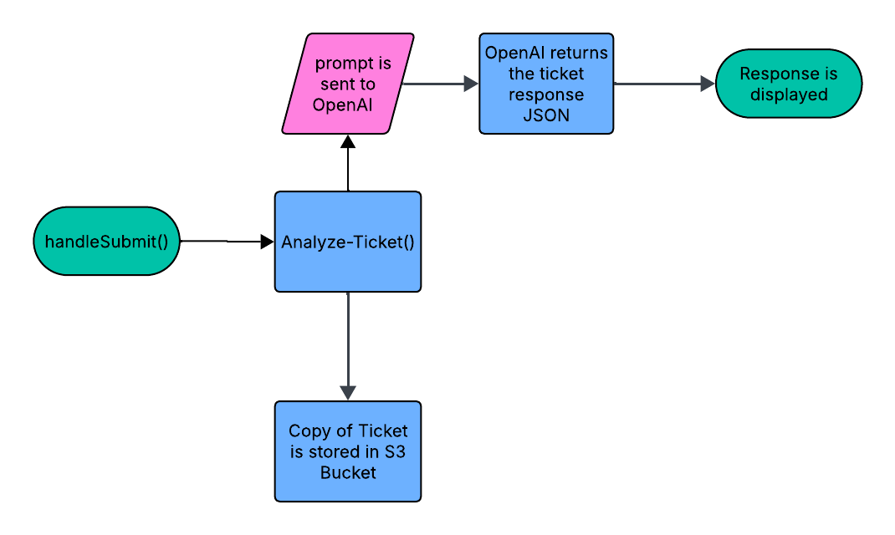

# Support Ticket Triage System

A full-stack application that asses support tickets and assigns priority using the OpenAI API Platform.



## Overview

This project allows a user to submit a suport ticket, where the OpenAI API assigns priority, teams, and catigorizes the issue. 
The goal of this project was to strengthen my understanding of:
- OpenAI API Platform
- FastAPI
- React 

---

## Why I Built This
My maing goal was to familiarize myself with a LLM platform like GPT and integrating it into a traditional style application. I really embraced AI for this application and admittedly used ChatGPT to generate my APP.jsx page. It almost feels like the new norm and akin to using boilerplate instead of starting from scratch. I remember hearing things like "nobody writes html and css from scratch anymore." That being said, I still understand the importance of knowing whats going on under the hood and having a good workflow. Eventually I'd like to store a copy of the support ticket triage into an Amazon bucket, but at the time of this writing I still haven't implemented it. 

## How to run
1. visit http://localhost/5173 after running```docker compose up --build```


## Dependencies

